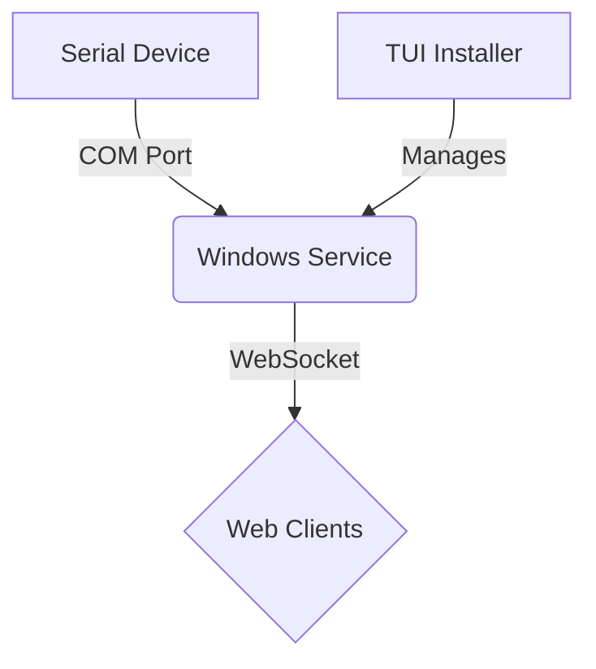

# Go Serial-to-WebSocket Service


[](https://golang.org/)
[](LICENSE)

A Windows service written in Go that reads data from a serial port and broadcasts it to web clients via WebSockets. It includes an interactive TUI installer for easy deployment and management.

## Architecture

This project consists of two main components:
1.  **The Windows Service (`service.go`):** A background process that connects to a serial device (like a weighing scale), reads the data, and forwards it to all connected WebSocket clients.
2.  **The TUI Installer (`installer.go`):** A terminal-based application that allows users to install, manage, and uninstall the Windows service. It embeds the service executable for a single-file distribution.



## Features

- **Real-time Data Broadcasting:** Instantly stream serial data to multiple web clients.
- **Windows Service Integration:** Runs as a native, background Windows service.
- **Interactive TUI Installer:** Easy-to-use terminal interface for installation and service management.
- **Self-Contained Executable:** The installer embeds the service, making distribution simple.
- **Environment Aware:** Separate build configurations for production and development environments.
- **Test Mode:** Includes a data simulation mode for development without physical hardware.

## Installation

1.  Download the latest installer executable (`BasculaInstalador_prod.exe` or `BasculaInstalador_test.exe`) from the [Releases](https://github.com/adcondev/daemonize-example/releases) page.
2.  Right-click the installer and select **"Run as administrator"**.
3.  Follow the on-screen instructions in the terminal interface to install and start the service.

## Usage

Once the service is running, it will host a WebSocket server at `ws://<your-ip>:8765`.

1.  **Connect a Client:** Use a WebSocket client (like the provided `web/html/index_envs.html` file) to connect to the server.
2.  **Receive Data:** The client will automatically start receiving data broadcasted from the serial port.
3.  **Configuration (Optional):** The web interface also allows for runtime configuration of the COM port, device brand, and test mode.

## Development

### Prerequisites

- Go 1.24.6+
- Task
- A Windows environment

### Setup

1.  **Clone the repository:**
    ```sh
    git clone https://github.com/adcondev/scale-daemon.git
    cd scale-daemon
    ```
2.  **Install dependencies:**
    Run the `init/deps.bat` script as an administrator to install Go, Task, and Go modules.

### Building

This project uses `Taskfile.yml` to automate builds.

-   **Build for Production:**
    ```sh
    task build:all
    ```
    This creates a production-ready installer (`bin/BasculaInstalador_prod.exe`) where the service listens on `0.0.0.0`.

-   **Build for Development/Testing:**
    ```sh
    task build:test
    ```
    This creates a test installer (`bin/BasculaInstalador_test.exe`) where the service listens only on `localhost`.

## Contributing

Contributions are welcome! Please feel free to submit a pull request or open an issue.

1.  Fork the repository.
2.  Create a new branch (`git checkout -b feature/your-feature`).
3.  Commit your changes (`git commit -m 'Add some feature'`).
4.  Push to the branch (`git push origin feature/your-feature`).
5.  Open a pull request.

## License

This project is licensed under the MIT License - see the [LICENSE](LICENSE) file for details.
