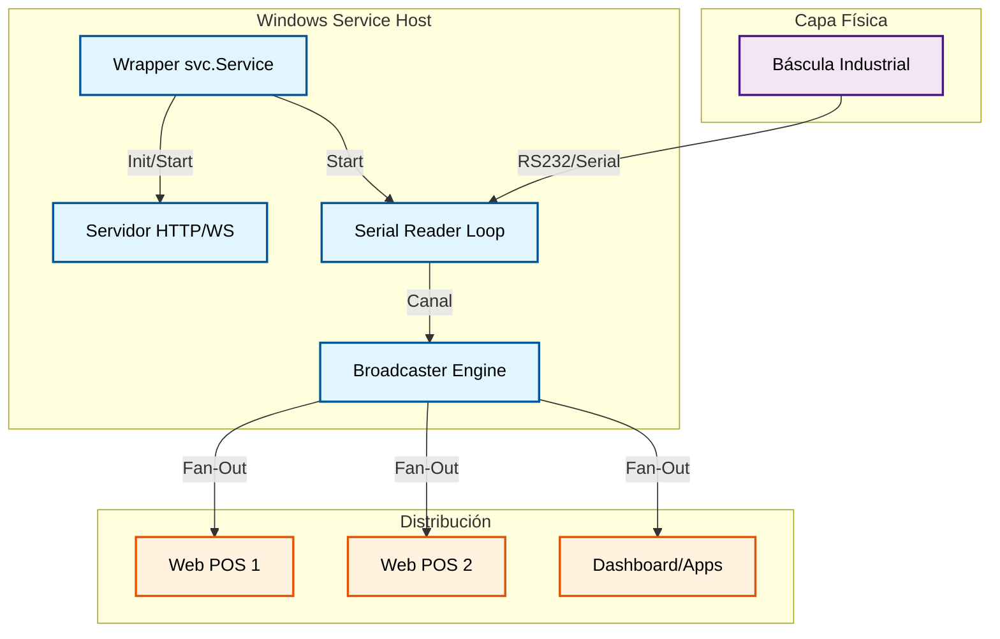
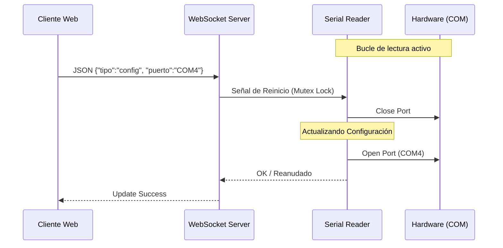

# ⚖️ Scale Daemon

**Scale Daemon** es un servicio de Windows de alto rendimiento diseñado para actuar como puente entre básculas industriales (RS232/Serial) y aplicaciones web modernas. A diferencia de soluciones simples, este daemon funciona como un middleware persistente que gestiona la reconexión automática, el filtrado de ruido y la distribución de datos mediante WebSockets de baja latencia.

El servicio está optimizado para entornos de **retail y logística**, permitiendo que cualquier navegador en la red local obtenga lecturas de peso en tiempo real sin necesidad de drivers adicionales en el cliente.

---

## 🏗️ Arquitectura del Sistema

El daemon utiliza un modelo de **Broadcaster asíncrono**. Un lector serial dedicado (Producer) alimenta un canal central, el cual distribuye los datos a todos los clientes WebSocket conectados (Consumers) de forma concurrente.

### Estructura de Componentes



### Modelo de Concurrencia y Hot-Reload

El servicio implementa un sistema de **configuración en caliente**. Al recibir un mensaje de configuración vía WebSocket, el daemon detiene de forma segura la goroutine de lectura actual, cierra el puerto serial y reinicia el bucle con los nuevos parámetros (Puerto, Marca o Modo Prueba) sin interrumpir las conexiones de otros clientes.



---

## 🚀 Características Principales

* 🔌 **Abstracción de Hardware**: Soporte para múltiples protocolos de básculas (Rhino, etc.) mediante comandos de solicitud de peso (`P`).
* 🔄 **Resiliencia Automática**: Estrategia de reintento con backoff ante desconexiones físicas del cable serial.
* 🧪 **Modo Simulación Integrado**: Generación de pesos aleatorios con fluctuación realista para desarrollo sin hardware físico.
* 🛠️ **Instalador Profesional**: TUI (Text User Interface) para gestionar el ciclo de vida del servicio (Instalar, Iniciar, Detener).
* 📊 **Dashboard de Diagnóstico**: Interfaz web embebida para monitorear el peso y probar la configuración visualmente.

---

## 📡 Protocolo WebSocket

### Endpoints

* **WebSocket**: `ws://[IP]:8765/ws` (Conexión para recibir datos de peso)
* **Dashboard**: `http://[IP]:8765/` (Interfaz visual embebida)

### Intercambio de Datos

**1. Mensaje de Ambiente (Servidor -> Cliente):**
Al conectar, el servidor envía información del entorno inyectada durante la compilación.

```json
{
  "tipo": "ambiente",
  "ambiente": "REMOTE",
  "version": "2026-01-29 14:08:03",
  "config": {
    "puerto": "COM3",
    "marca": "Rhino BAR 8RS",
    "modoPrueba": false
  }
}

```

**2. Lectura de Peso (Broadcasting):**
El peso se envía como un string simple o JSON dependiendo de la estabilidad de la trama.

```json
"15.42"

```

---

## ⚙️ Configuración y Build

El proyecto utiliza un `Taskfile` para gestionar compilaciones inyectando variables en tiempo de enlace (`ldflags`).

| Tarea | Descripción |
| --- | --- |
| `task build:local` | Compila instalador para entorno de pruebas (localhost). |
| `task build:remote` | Compila instalador para producción (0.0.0.0). |
| `task build:console` | Genera ejecutables de consola para debugging rápido. |
| `task clean` | Limpia binarios y archivos temporales. |

### Inyección de Metadatos

El proceso de build inyecta automáticamente:

* `BuildEnvironment`: Define el alcance de la red.
* `ServiceName`: Nombre del servicio en el SCM de Windows.
* `BuildDate/Time`: Estampa de tiempo de la versión.

---

## 📂 Estructura del Proyecto

```text
scale-daemon/
├── cmd/
│   ├── BasculaServicio/    # Código principal del Daemon
│   └── BasculaInstalador/  # TUI para instalación del servicio
├── internal/
│   └── assets/             # Recursos web (HTML/JS) embebidos
├── tmp/                    # Binarios temporales para el empaquetado
├── bin/                    # Artefactos finales (Instaladores)
├── embedded.go             # Implementación de go:embed
└── Taskfile.yml            # Automatización de tareas

```

---

## 📝 Logs y Mantenimiento

Los logs se almacenan en `%PROGRAMDATA%` con un sistema de **autorrotación** para prevenir el llenado del disco:

* **Ruta**: `C:\ProgramData\R2k_Bascula_Remote\R2k_Bascula_Remote.log`
* **Límite**: 5 MB (al excederse, se conservan las últimas 1000 líneas para trazabilidad).
