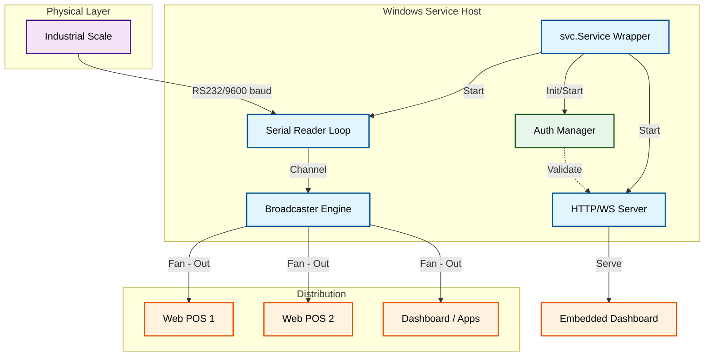
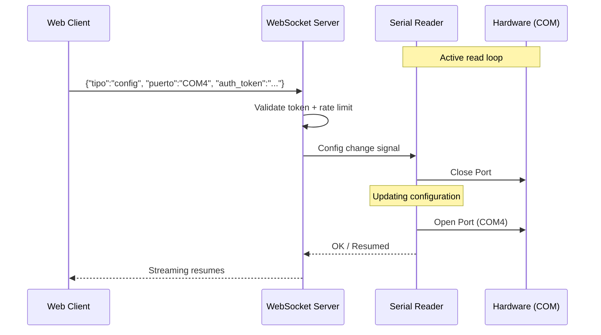

# ⚖️ Scale Daemon


<!--  -->

**Scale Daemon** is a high-performance Windows Service designed to bridge industrial weighing scales (RS232/Serial) with
modern web applications. Unlike simple serial readers, this daemon acts as persistent middleware that handles automatic
reconnection, noise filtering, and data distribution via low-latency WebSockets.

Optimized for **retail and logistics** environments, it allows any browser on the local network to receive real-time
weight readings without installing additional drivers on the client.

---

## 🏗️ System Architecture

The daemon uses an **asynchronous Broadcaster** model. A dedicated serial reader (Producer) feeds a central channel,
which distributes data concurrently to all connected WebSocket clients (Consumers).

### Component Overview


```mermaid
graph TD
    classDef go fill: #e1f5fe, stroke: #01579b, stroke-width: 2px, color: #000
    classDef data fill: #fff3e0, stroke: #e65100, stroke-width: 2px, color: #000
    classDef hw fill: #f3e5f5, stroke: #4a148c, stroke-width: 2px, color: #000
    classDef sec fill: #e8f5e9, stroke: #1b5e20, stroke-width: 2px, color: #000

    subgraph Host["Windows Service Host"]
        direction TB
        Service["svc.Service Wrapper"]:::go -->|Init/Start| Auth["Auth Manager"]:::sec
        Service -->|Start| HTTP["HTTP/WS Server"]:::go
        Service -->|Start| Reader["Serial Reader Loop"]:::go
        Reader -->|Channel| Broadcast["Broadcaster Engine"]:::go
        Auth -.->|Validate| HTTP
    end

    subgraph Hardware["Physical Layer"]
        Scale["Industrial Scale"]:::hw -->|RS232/9600 baud| Reader
    end

    subgraph Network["Distribution"]
        Broadcast -->|Fan - Out| Client1["Web POS 1"]:::data
        Broadcast -->|Fan - Out| Client2["Web POS 2"]:::data
        Broadcast -->|Fan - Out| ClientN["Dashboard / Apps"]:::data
    end

    HTTP -->|Serve| Dashboard["Embedded Dashboard"]:::data
```

### Concurrency & Hot-Reload Model

The service implements a **hot-swap configuration** system. When a config message is received via WebSocket, the daemon
safely stops the current read goroutine, closes the serial port, and restarts the loop with new parameters (Port, Brand,
or Test Mode) — without disconnecting other clients.


```mermaid
sequenceDiagram
    participant C as Web Client
    participant S as WebSocket Server
    participant R as Serial Reader
    participant H as Hardware (COM)
    Note over R, H: Active read loop
    C ->> S: {"tipo":"config", "puerto":"COM4", "auth_token":"..."}
    S ->> S: Validate token + rate limit
    S ->> R: Config change signal
    R ->> H: Close Port
    Note over R: Updating configuration
    R ->> H: Open Port (COM4)
    R -->> S: OK / Resumed
    S -->> C: Streaming resumes
```

---

## 🚀 Features

- 🔌 **Hardware Abstraction** — Multi-brand scale support via configurable serial commands (Rhino, etc.)
- 🔄 **Automatic Resilience** — Retry strategy with backoff for physical cable disconnections
- 🧪 **Built-in Simulation Mode** — Realistic fluctuating weight generation for development without physical hardware
- 📊 **Embedded Diagnostic Dashboard** — Web interface served via `go:embed` for real-time weight monitoring and
  configuration
- 🔐 **Layered Security** — bcrypt login, session cookies (HttpOnly/SameSite), brute-force lockout, per-client rate
  limiting, and config token authorization
- 🚨 **Real-Time Error Broadcasting** — Connection failures (port not found, cable disconnected) are pushed to clients
  via WebSocket, not just logged server-side
- ♻️ **Hot Configuration Reload** — Change serial port, scale brand, or test mode via WebSocket without restarting the
  service
- 📝 **Auto-Rotating Logs** — 5 MB threshold with last-1000-line preservation and verbose/quiet filtering
- 🏥 **Health Endpoint** — JSON health check with scale connection status, uptime, and build info

---

## 📡 WebSocket Protocol

The API uses a **hybrid protocol**: JSON objects for control/metadata, raw JSON strings for weight data streaming (
minimizing overhead).

| Endpoint                      | Description                           |
|-------------------------------|---------------------------------------|
| `ws://{host}:{port}/ws`       | Real-time weight data + configuration |
| `http://{host}:{port}/`       | Embedded diagnostic dashboard         |
| `http://{host}:{port}/health` | Service health check (JSON)           |
| `http://{host}:{port}/ping`   | Latency check → `pong`                |

### Weight Streaming

```json
"15.42"
```

### Error Codes (Broadcast)

| Code             | Description                   |
|------------------|-------------------------------|
| `ERR_SCALE_CONN` | Cannot open serial port       |
| `ERR_EOF`        | Cable physically disconnected |
| `ERR_TIMEOUT`    | Scale not responding (5s)     |
| `ERR_READ`       | Read error (noise/driver)     |

> 📄 Full API documentation: [`api/v1/SCALE_WEBSOCKET_V1.md`](api/v1/SCALE_WEBSOCKET_V1.md) | JSON Schema: [
`api/v1/scale_websocket.schema.json`](api/v1/scale_websocket.schema.json)

---

## 🔐 Security

| Layer               | Protects                 | Mechanism                                  |
|---------------------|--------------------------|--------------------------------------------|
| **Dashboard Login** | Panel access (`/`)       | bcrypt password + HttpOnly session cookie  |
| **Config Token**    | WebSocket config changes | Auth token validated per message           |
| **Rate Limiter**    | Config abuse             | Max 15 changes/min per client              |
| **Brute Force**     | Login attacks            | IP lockout after 5 failed attempts (5 min) |

### Access Model

```
PUBLIC (no auth required)
├── GET  /login          Login page
├── POST /auth/login     Process login
├── GET  /ping           Latency check
├── GET  /health         Service diagnostics
├── WS   /ws             Weight streaming + config (token protected)
├── GET  /css/*          Static assets
└── GET  /js/*           Static assets

PROTECTED (session required)
└── GET  /               Dashboard (injects config token)
```

> **Note:** `/ws` is public so POS applications can receive weight data without dashboard authentication. Config changes
> within WebSocket are protected by the `auth_token`, only available to authenticated dashboard sessions.

---

## ⚙️ Getting Started

### Prerequisites

- **Go** 1.24+ ([download](https://go.dev/dl/))
- **Task** (Taskfile runner) — `go install github.com/go-task/task/v3/cmd/task@latest`
- **Windows** (the service uses Windows SCM APIs)

### Installation

```bash
# Clone the repository
git clone https://github.com/adcondev/scale-daemon.git
cd scale-daemon

# Install Go dependencies
go mod download
```

### Configuration

Create a `.env` file in the project root:

```env
# ⚠️ Do NOT commit to version control
SCALE_DASHBOARD_HASH=<base64-encoded-bcrypt-hash>
SCALE_AUTH_TOKEN=<your-secret-token>
BUILD_ENV=local
```

| Variable               | If Empty                                | Description                                   |
|------------------------|-----------------------------------------|-----------------------------------------------|
| `SCALE_DASHBOARD_HASH` | Auth disabled (direct dashboard access) | bcrypt hash (base64) for dashboard login      |
| `SCALE_AUTH_TOKEN`     | Config changes accepted without token   | Token required in WebSocket `config` messages |

### Build & Run

```bash
# Build the service binary (console mode)
task build

# Build and run immediately
task run

# Clean build artifacts
task clean
```

### Running Tests

```bash
# Run all tests with race detection
go test -v -race ./...

# Run benchmarks
go test -bench=. -benchmem ./...

# Run linter
golangci-lint run --config=.golangci.yml
```

---

## 📂 Project Structure

```
scale-daemon/
├── api/v1/                  # API documentation & JSON Schema
├── cmd/BasculaServicio/     # Service entry point (main.go)
├── internal/
│   ├── assets/web/          # Embedded web dashboard (HTML/CSS/JS)
│   ├── auth/                # Authentication, sessions, brute-force protection
│   ├── config/              # Runtime configuration with hot-swap
│   ├── daemon/              # Service lifecycle (Init/Start/Stop)
│   ├── logging/             # Log rotation, filtering, secure file access
│   ├── scale/               # Serial port reader, brand commands, simulation
│   └── server/              # HTTP/WS server, broadcaster, rate limiting, models
├── .github/
│   ├── workflows/           # CI, CodeQL, PR automation, PR status dashboard
│   └── codeql-config.yml    # CodeQL security analysis config
├── embed.go                 # go:embed directive for web assets
├── Taskfile.yml             # Build automation with ldflags injection
├── .golangci.yml            # Linter configuration (15+ linters)
└── go.mod                   # Go module definition
```

---

## 📝 Logs

Logs are stored in `%PROGRAMDATA%` with an **auto-rotation** system:

- **Path:** `C:\ProgramData\{ServiceName}\{ServiceName}.log`
- **Limit:** 5 MB (when exceeded, last 1000 lines are preserved)
- **Filtering:** Non-critical messages (weight readings, client connect/disconnect) are suppressed when verbose mode is
  off
- **Fallback:** If the log directory is not writable (console mode), logs go to stdout

---

## 🤝 Contributing

Contributions are welcome! Please ensure:

1. PR titles follow [Conventional Commits](https://www.conventionalcommits.org/) (enforced by CI)
2. All tests pass with race detection (`go test -race ./...`)
3. Code passes `golangci-lint` with the project config
4. Use the [PR template](.github/pull_request_template.md) provided

---

## 📄 License

This project is licensed under the [MIT License](LICENSE).

Copyright (c) 2025 Red 2000
