# Scale Daemon (BasculaServicio)


**Scale Daemon** is a robust Windows Service designed to bridge the gap between industrial hardware scales and modern web applications. It reads weight data from serial ports (RS232) in real-time and broadcasts it via a high-performance WebSocket server, allowing any web client to display weight readings instantly.

It comes with a professional **TUI (Text User Interface) Installer** that simplifies deployment, management, and configuration.

## 🏗 Architecture

The system follows a producer-consumer pattern where the service acts as a middleware between the hardware and the frontend.

```mermaid
graph LR
    subgraph Hardware
        Scale[⚖️ Industrial Scale]
    end

    subgraph "Windows Service (Go)"
        SerialReader[🔌 Serial Reader]
        Broadcaster[📡 WebSocket Broadcaster]
        Config[⚙️ Config Manager]
    end

    subgraph Clients
        Web[💻 Web Dashboard]
        App[📱 Mobile App]
    end

    Scale -- RS232 (COM3) --> SerialReader
    SerialReader -- Weight Data --> Broadcaster
    Broadcaster -- WS (ws://*:8765) --> Web
    Broadcaster -- WS (ws://*:8765) --> App
    
    Config -. Hot Reload .-> SerialReader
```



## 🚀 Features

- **Real-time Broadcasting:** Low-latency weight updates via WebSockets.
- **Robust Serial Communication:** Automatic reconnection, noise filtering, and timeout handling.
- **Interactive Installer:** A beautiful CLI tool to Install, Start, Stop, and Uninstall the service.
- **Hot Configuration:** Change serial ports or scale brands on the fly without restarting the service.
- **Simulation Mode:** Built-in test mode to simulate weight data for development without hardware.
- **Multi-Environment:** Separate configurations for Production and Test/Dev environments.

## 📦 Installation

This project includes a self-contained installer.

1.  **Download** the latest release (`BasculaInstalador_prod.exe`).
2.  **Run as Administrator** (Required to install Windows Services).
3.  Use the arrow keys to select **[+] Instalar Servicio**.
4.  Once installed, select **[>] Iniciar Servicio**.

## 🛠 Usage

### WebSocket API
The service exposes a WebSocket endpoint at `ws://localhost:8765` (or the server's IP).

**Message Format (Server -> Client):**
```json
"12.50"
```
*The server sends the raw weight as a string.*

**Configuration (Client -> Server):**
You can send a JSON message to configure the service:
```json
{
  "tipo": "config",
  "puerto": "COM1",
  "marca": "Rhino",
  "modoPrueba": false
}
```

## 💻 Development

### Prerequisites
- Go 1.24+
- [Task](https://taskfile.dev/) (Taskfile)

### Build Commands

We use `Taskfile` to manage builds:

```bash
# Build for Production (Listens on 0.0.0.0)
task build:all

# Build for Test (Listens on localhost, enables file logging)
task build:test

# Build only the service
task service:build

# Build only the installer
task installer:build
```

## 🤝 Contributing

1.  Fork the repository.
2.  Create a feature branch (`git checkout -b feature/amazing-feature`).
3.  Commit your changes (`git commit -m 'Add amazing feature'`).
4.  Push to the branch (`git push origin feature/amazing-feature`).
5.  Open a Pull Request.

## 📄 License

Distributed under the MIT License. See `LICENSE` for more information.
