# 📊 Scale Daemon: Windows Service for Serial Scales

<div align="center">


**A native Windows service that reads data from serial scales and broadcasts it to web clients via WebSockets.**

</div>

<div align="center">

[](https://golang.org)
[](https://opensource.org/licenses/MIT)
[](https://github.com/adcondev/scale-daemon/actions)
[](https://github.com/adcondev/scale-daemon/releases)

</div>

---

## 📋 Overview

**Scale Daemon** is a lightweight yet powerful Windows service designed to bridge the gap between traditional industrial hardware and modern web applications. It seamlessly reads data from any serial-port-connected scale and broadcasts it in real-time using a WebSocket server.

The project includes a user-friendly **Terminal User Interface (TUI)** for easy installation and management, and it supports multiple environments (`production` and `test`) out of the box.

### 🎯 Key Features

- **Native Windows Service**: Runs silently in the background with automatic startup.
- **Real-Time WebSocket Broadcasting**: Delivers instant data to any connected web client.
- **Hardware Integration**: Communicates with industrial scales via serial (COM) ports.
- **Interactive TUI Installer**: Simplifies installation, uninstallation, and service management.
- **Multi-Environment Support**: Separate configurations for production and testing.
- **Automatic Reconnection**: Robust error handling for uninterrupted service.

---

## 🏗️ Architecture

The system is composed of three main components: the **Windows Service**, the **TUI Installer**, and the **Web Client**.

```mermaid
graph TD
    subgraph "Hardware"
        Scale[<font size=5>⚖️</font><br>Serial Scale]
    end

    subgraph "Windows Service (Go)"
        A[Serial Port Reader] -->|Weight Data| B{WebSocket Broadcaster}
        C[<font size=5>⚙️</font><br>Dynamic Config] <--> B
    end

    subgraph "Web Clients"
        D[<font size=5>🖥️</font><br>Client 1]
        E[<font size=5>💻</font><br>Client 2]
        F[...]
    end

    subgraph "Installer (Go TUI)"
        Installer[<font size=5>📦</font><br>TUI Installer] -->|Installs/Manages| A
    end

    Scale --> A
    B -- ws:// --> D
    B -- ws:// --> E
    B -- ws:// --> F

    style Scale fill:#f9f,stroke:#333,stroke-width:2px
    style A fill:#bbf,stroke:#333,stroke-width:2px
    style B fill:#bbf,stroke:#333,stroke-width:2px
    style Installer fill:#9f9,stroke:#333,stroke-width:2px
```



---

## 🚀 Getting Started

### Prerequisites

- **Windows 10/11** (64-bit)
- **Administrator Privileges** (for installation)

### Installation

1. **Download** the latest installer (`BasculaInstalador_Remoto.exe`) from the [Releases](https://github.com/adcondev/scale-daemon/releases) page.
2. **Run as Administrator**.
3. Follow the on-screen instructions in the interactive TUI to **install**, **start**, and **manage** the service.

---

## 💻 Usage

Once the service is running, you can connect to it from any web application using a standard WebSocket client.

### Example JavaScript Client

```javascript
// Connect to the service (update the IP if running on a different machine)
const ws = new WebSocket('ws://localhost:8765');

// Listen for incoming weight data
ws.onmessage = (event) => {
    const weight = event.data;
    console.log('Weight received:', weight);
    // Update your application's UI with the new weight
};

// Optional: Send a new configuration to the service
function updateConfig(port, brand, testMode) {
    const config = {
        tipo: "config",
        puerto: port,       // e.g., "COM3"
        marca: brand,       // e.g., "Rhino BAR 8RS"
        modoPrueba: testMode // true or false
    };
    ws.send(JSON.stringify(config));
}
```

---

## 🛠️ Development

### Prerequisites

- **Go 1.24.6**
- **Task** (`go install github.com/go-task/task/v3/cmd/task@latest`)

### Build from Source

1. **Clone the repository**:
   ```sh
   git clone https://github.com/adcondev/scale-daemon.git
   cd scale-daemon
   ```
2. **Install dependencies**:
   ```sh
   go mod tidy
   ```
3. **Build for production**:
   ```sh
   task build:all
   ```
4. **Build for testing/development**:
    ```sh
    task build:test
    ```

The compiled binaries will be available in the `./bin` directory.

---

## 🤝 Contributing

Contributions are welcome! Please feel free to submit a pull request or open an issue if you have ideas for improvements.

1. Fork the repository.
2. Create your feature branch (`git checkout -b feature/AmazingFeature`).
3. Commit your changes (`git commit -m 'Add some AmazingFeature'`).
4. Push to the branch (`git push origin feature/AmazingFeature`).
5. Open a pull request.

---

## 📄 License

This project is licensed under the MIT License. See the [LICENSE](LICENSE) file for details.

---

<div align="center">
<i>Developed with ❤️ by Red 2000</i>
</div>
